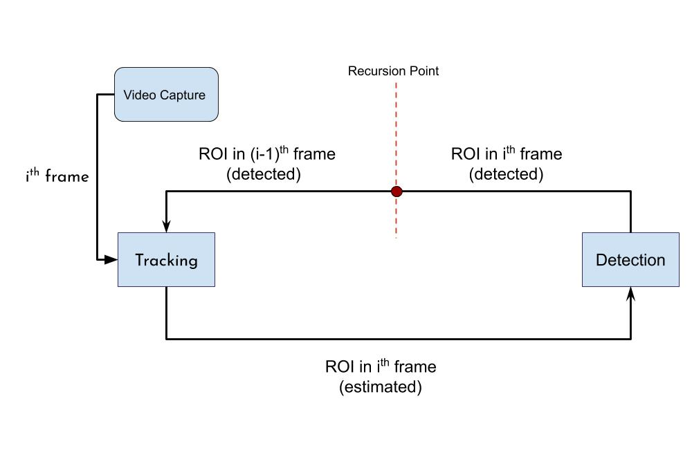
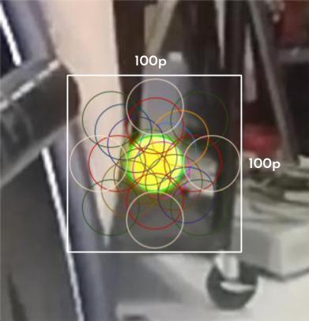
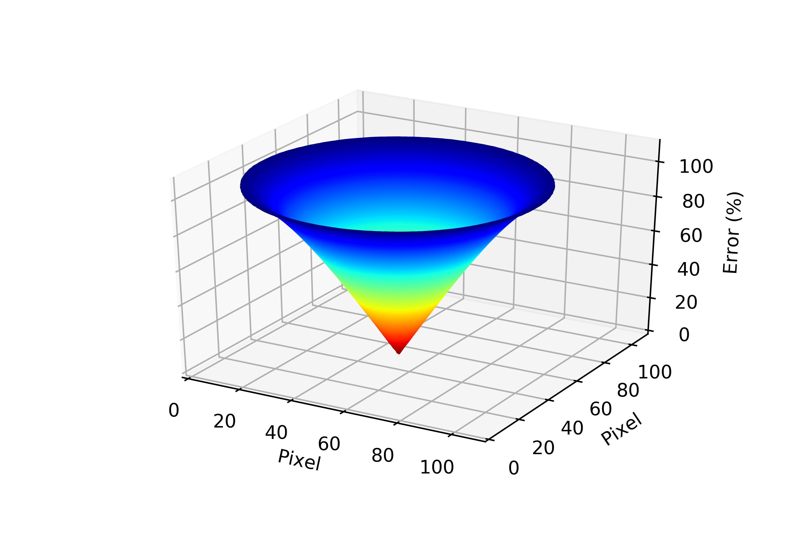
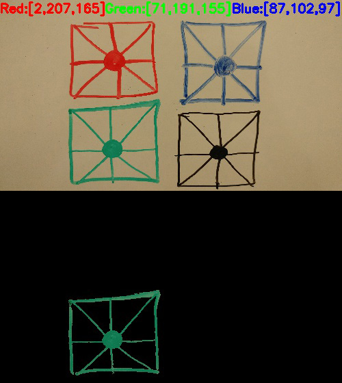
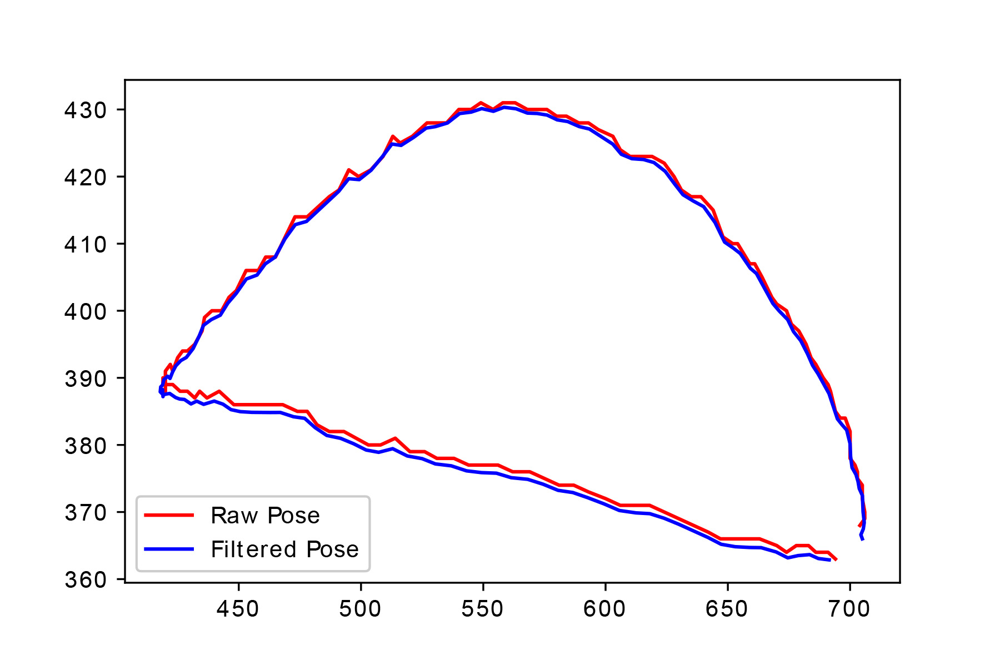
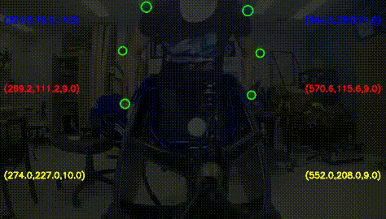
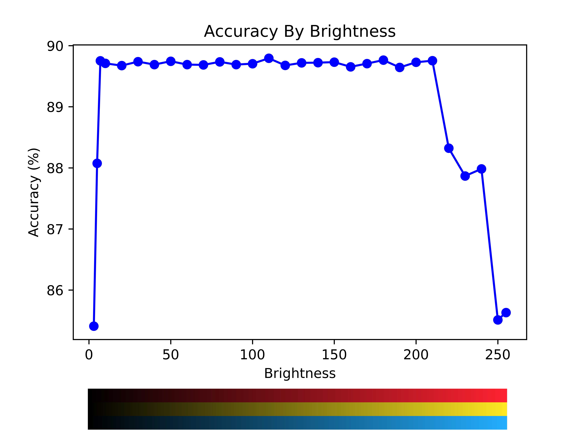

# Master-Project

## Detection And Tracking of Sphere Markers

The following flowchart shows a simplified process the algorithm does to track and detect the position of a marker.

Markers are attached to the joints of body to simulate the motion.

 

It would return next frame everytime the videocapture is called.

# Tracking
Tracking is done by finding an ROI (Region of Interest) in the next frames based on the ROI tracker learned in the first frame.

 

# Error Function

A slightly miss-placed detection cause an error (because the detected circle is not completely matched to the marker).

Error space: Assume we know (for simplicity) the size of the marker (which depends on the distance of it and the camera). Hence, the set of all possible positions of the circle a detection method finds would make the error space.

Here is a demonstration of the error space.

 

The green circle at the middle represents the true position of the marker.

Error Function: is a function which reduces the value of error as a circle gets closer to the true position of the marker (and true size if we extend the problem).

Here is the error function figured with the assumption of the size of the marker is known a priori.

 

We optimize an edge circle detection method for its inputs to minimize the error.

# Color Detection

A mask to filter non-favorite colors in HSV (hue) is made.

Here is an example of filtering non-desired colors.

 

# Smoothing

Kalman Filter is used to reduce fluctuation error caused by detector.

Figure below shows how kalman filter can smooth the path.

 

# Results

Putting all together: see the figure below. Non-detected area is converted to grayscale for better demonstration

 

# Brightness Challenge

The accuracy of the desined algorithm is tested in different brightness intensities (value in HSV sopace).

Here is three brightness samples:

Low light:

 

Medium light:

 

Bright light:

 

Results: figure below shows how accuracy changes when illumination changes.

 

Python codes are lisenced and cannot be published publicly.
